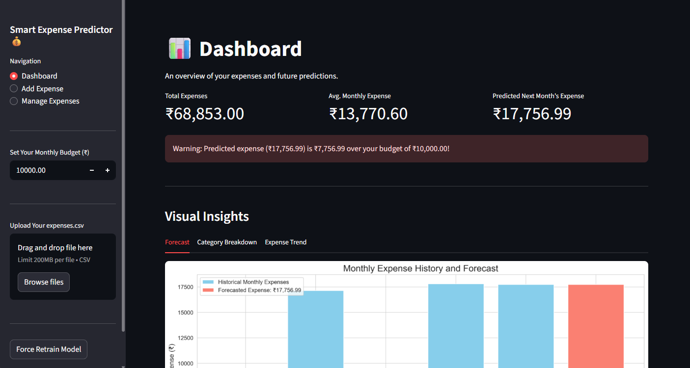
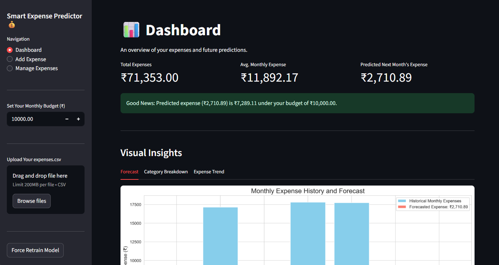

-----

# Smart Expense Predictor 💰


---
A user-friendly, offline-compatible web application built with Streamlit to help you track, manage, and visualize your personal expenses. Leveraging an XGBoost machine learning model, this tool not only provides insights into your historical spending habits but also forecasts your total expenses for the upcoming month—empowering you to budget proactively.

-----

## 📋 Table of Contents

1. [Live Demo](#-live-demo)  
2. [Features](#-features)  
3. [Tech Stack](#-tech-stack)  
4. [Project Structure](#-project-structure)  
5. [Installation](#-installation)  
6. [Usage Guide](#-usage-guide)  
7. [How It Works](#-how-it-works)  
8. [Contributing](#-contributing)  
9. [License](#-license) 

-----

## 🚀 Live Demo

 👇Click here to view demo

[](https://smart-expense-predictor.streamlit.app/)


#### Application Screenshot

*Example of the main dashboard showing key metrics, charts, and forecast.*




-----

## ✨ Features

### 1\. Interactive Dashboard

A clean, intuitive interface that serves as your financial control center, surfacing:

  - **Key Metrics**: Total accumulated expenses and average monthly spending.
  - **Budget vs. Forecast**: Set a monthly budget and see a clear warning if your forecasted expenses are projected to exceed it.
  - **Intelligent Forecasting**: A data-driven prediction of your total expenses for the upcoming month, powered by an XGBoost model.

### 2\. Full Data Management (CRUD)

Complete control over your financial data.

  - **Create**: Add new expense transactions through a simple form.
  - **Read**: View all expense records in a clean, interactive table.
  - **Update**: Edit any detail of a past transaction directly within the data table.
  - **Delete**: Remove records that are no longer needed.
  - **Bulk CSV Upload**: Quickly populate your data by uploading an `expenses.csv` file.

### 3\. Rich Visual Insights

  - **Monthly Forecast Chart**: A bar chart comparing historical monthly spending against the predicted amount for the next month.
  - **Category Breakdown Pie Chart**: A pie chart showing where your money is going by expense category.
  - **Daily Spending Trend**: A line chart that plots daily expenses over time to reveal trends and spending spikes.

### 4\. Automatic Model Retraining

The machine learning model automatically retrains in the background whenever you add, edit, or delete data, ensuring your forecasts are always based on the most up-to-date information.

-----

## 🛠️ Tech Stack

  - **Language**: [Python 3.8+](https://www.python.org/)
  - **Web Framework**: [Streamlit](https://streamlit.io/)
  - **ML Libraries**: [XGBoost](https://xgboost.ai/), [scikit-learn](https://scikit-learn.org/)
  - **Data Handling**: [pandas](https://pandas.pydata.org/)
  - **Visualization**: [Matplotlib](https://matplotlib.org/) & [Seaborn](https://seaborn.pydata.org/)

-----

## 📂 Project Structure

```plaintext
smart-expense-predictor/
├── assets/
│   └── screenshot.png      # screenshots for README
├── data/
│   └── expenses.csv        # User data (auto-generated if not present)
├── models/
│   └── model.pkl           # Serialized XGBoost model (auto-generate)
├── src/
│   ├── __init__.py
│   ├── data_processor.py   # Loads, saves, and preprocesses data
│   ├── ml_model.py         # Trains, predicts, and persists the XGBoost model
│   ├── utils.py            # Helper functions (e.g., budget checks)
│   └── visualizer.py       # Generates all Matplotlib/Seaborn plots
├── app.py                  # Main Streamlit application entrypoint
├── requirements.txt        # Python dependencies
└── README.md               # Project documentation
```

-----

## ⚙️ Installation

### 1\. Clone the Repository

```bash
git clone https://github.com/udhay8005/smart-expense-predictor.git
cd smart-expense-predictor
```

### 2\. Create & Activate a Virtual Environment

  * **Windows**
    ```bash
    python -m venv venv
    .\venv\Scripts\activate
    ```
  * **macOS / Linux**
    ```bash
    python3 -m venv venv
    source venv/bin/activate
    ```

### 3\. Install Dependencies

```bash
pip install -r requirements.txt
```

### 4\. Run the Application Locally

```bash
streamlit run app.py
```

Open your browser and navigate to `http://localhost:8501`.

-----

## 📖 Usage Guide

1.  **Launch the App**: Follow the installation steps to start the Streamlit server.

2.  **Add Expenses**:

      - **Manual Entry**: On the main dashboard, use the "Add Expense" form to enter the date, amount, category, and a description. Click "Save Expense".
      - **Bulk Upload**: In the sidebar, use the "Upload CSV" feature to import a file with the columns: `Date,Amount,Category,Description`.

3.  **Set Your Monthly Budget**:

      - Enter your target monthly spending limit in the sidebar input box. The dashboard will automatically compare this budget against the forecasted expense.

4.  **Interact with the Dashboard**:

      - View your key metrics, forecast, and budget status at the top.
      - Hover over the charts to see detailed values for monthly, categorical, or daily spending.

5.  **Manage Existing Transactions**:

      - Navigate to the "Manage Expenses" page from the sidebar.
      - Here, you can edit data directly in the table or select rows to delete.
      - Click "Save Changes" to update your `expenses.csv` file and retrain the model.

-----

## 🧠 How It Works

### 1\. Data Processing (`src/data_processor.py`)

  - **Storage**: All expense data is read from and saved to `data/expenses.csv`.
  - **Preprocessing**: The module converts `Date` strings into datetime objects, sorts records chronologically, and aggregates daily expenses into monthly totals to prepare the data for the model.

### 2\. Machine Learning Model (`src/ml_model.py`)

  - **Feature Engineering**: A simple but effective time-series feature, `Month_Num` (a unique, sequential integer for each month), is created.
  - **Model**: An `XGBoost Regressor` is trained to learn the relationship between `Month_Num` and `TotalMonthlyExpense`.
  - **Prediction**: To forecast the next month's spending, the model is fed the last known `Month_Num + 1`.
  - **Persistence**: The trained model is saved as `models/model.pkl` and is reloaded on startup. It is automatically retrained whenever the underlying expense data is modified.

### 3\. Visualization (`src/visualizer.py`)

  - This module uses Matplotlib and Seaborn to generate all the plots displayed on the dashboard, creating a rich, visual experience for the user.


-----

## 📄 License

This project is licensed under the MIT License. See the [LICENSE](./LICENSE) file for details.

-----

# ⚙️ install_clean.ps1 – Safe Pip Installer Script for Windows

This PowerShell script is a **safe and smart setup utility** you can run before installing your Python project dependencies. It solves common issues that happen during `pip install`, especially on Windows systems.

---

## 🚀 What This Script Fixes

- 🧨 Corrupt `.whl` files  
- 🚫 Temp folder lock errors like `WinError 32`  
- ❌ `--user` issues inside virtual environments  
- 🔁 Stuck or repeated install failures  
- 🐌 Slow installs due to cache or antivirus  
- 🧱 Heavy packages like `xgboost`, `scipy`, `pandas`, etc.

---

## ✅ What the Script Does

- **`pip cache purge`**  
  Removes old cached `.whl` files that may be corrupted.

- **Delete `pip-unpack-*` from temp folder**  
  Cleans temporary folders in `%TEMP%` that can block file access during installs.

- **Activate virtual environment**  
  Ensures `pip` installs packages inside your `.venv`, not globally.

- **Install `xgboost` locally (optional)**  
  Installs heavy wheels manually (like `xgboost`) if a local `.whl` is present.

- **Edit `requirements.txt`**  
  Temporarily removes `xgboost` to avoid redundant installation.

- **Install all dependencies**  
  Installs everything using `pip install -r requirements.txt --no-cache-dir` for a clean, reliable setup.

---

## 🤔 When to Use This Script

Use this script **before running `pip install`** in the following situations:

- 🧨 **You get `WinError 32` errors**  
  This script clears locked temp files that cause this issue.

- 🔁 **`pip install` keeps failing repeatedly**  
  Likely due to broken wheel files or cache — this script cleans it up.

- 🐌 **Installations are very slow or stuck**  
  Avoids delays caused by pip bugs or antivirus by installing fresh.

- 💥 **`pip install` crashes halfway**  
  Removes partial downloads so they don’t block future installs.

- ❌ **You accidentally used `--user` in a virtual environment**  
  This script ensures you're installing in the correct `.venv`.

- 📦 **You already have a local `.whl` for `xgboost`**  
  Saves bandwidth and avoids heavy downloads again.

- 🔄 **You recently rebuilt or recreated your `.venv`**  
  Starts with a clean setup, avoiding leftover conflicts.

---

## 🧠 Pro Tip

Include this script in your project repo. After cloning, users can just run:

```powershell
.\install_clean.ps1
```
To set up everything without error.

## 🧪 Example Output

```[CLEAN] Purging pip cache...
[CLEAN] Removing pip temporary unpack files...
[ENV] Activating virtual environment...
[OK] Virtual environment activated.
[INSTALL] Found xgboost wheel. Installing locally...
[EDIT] Removing xgboost from requirements.txt temporarily...
[INSTALL] Installing other requirements from requirements.txt...
[FINISHED] ✅ All steps completed successfully.
```

📁 **File:** `install_clean.ps1`  
👉 Place this script in your project root (same location as `requirements.txt`).

@udhayachandra